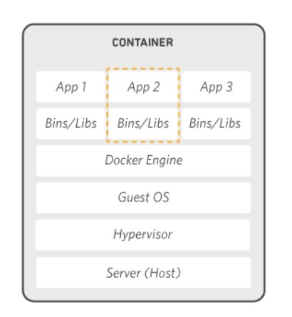

# 觀念

## 容器

### 容器是甚麼

單一容器可用於執行從小型微服務、軟體程序、大型應用。
容器內包含必要的執行檔、二進位程式碼、程式庫和組態檔，因此可以運行於任意主機上。
在執行階段，每個容器皆是相互隔離的，並且擁有各自的CPU、RAM、Disk、Networking。
綜上所述，可以知道他們更輕巧、更容易攜帶，而且運行成本也大幅降低。
在較大型的應用程式部署中，可將多個容器部署為一或多個容器叢集。這類叢集可能由容器編排器管理，例如: [Kubernetes](https://ithelp.ithome.com.tw/articles/10192401)。

[10個Q&A快速認識Container/Docker](https://www.ithome.com.tw/news/91847)

### 與 虛擬機 的差別

[深入研究](https://www.netapp.com/blog/containers-vs-vms/)
[Google Container](https://cloud.google.com/learn/what-are-containers)

### 容器的優點

1. 輕量化 & 運行成本更低
   與傳統或硬體虛擬機器環境相比，容器所需的系統資源較少，因為 容器不含作業系統映像。
2. 可攜性更高
   在 容器中執行的應用程式可輕鬆部署到多個不同的作業系統和硬體平台。
3. 作業更一致
   DevOps 開發維運團隊知道無論應用程式部署在何處，容器中的應用程式都會執行相同的作業。
4. 效率更高
   容器可讓應用程式更快速地部署、修補或擴充。
5. 更出色地完成應用程式開發
   容器支援敏捷和 DevOps 開發維運作業，可加速開發、測試和正式作業週期。

---

## Docker

### 介紹

「**Docker本身并不是容器，它是创建容器的工具，是应用容器引擎。**」--[小枣君](https://zhuanlan.zhihu.com/p/53260098)

[Docker](https://www.docker.com/)是開放的平台，協助開發者於開發、搬運、執行容器。

Docker的三大概念：

1. 鏡相(Image)
2. 容器(Container)
3. 倉庫(Repository)

[Docker的三大核心組件：鏡像，容器與倉庫](https://codertw.com/%E7%A8%8B%E5%BC%8F%E8%AA%9E%E8%A8%80/725595/)

### 為甚麼要使用Docker

1. 更短的啟動時間
2. 一致的運行環境
3. 更輕鬆的遷移

## Docker Compose

### 介紹

Docker Compose協助定義一個或多個容器，使用YAML檔案

### 為甚麼要使用Docker Compose

簡化多次的docker run、docker exec的指令，還有許多的設定參數可以使用。

---

## 參考文獻 / More Info

* [AWS Docker](https://aws.amazon.com/tw/docker/)
* [Docker Engine](https://docs.docker.com/engine/)
* [NetApp-Container介紹](https://www.netapp.com/zh-hant/devops-solutions/what-are-containers/)
* [Container s. VM](https://www.netapp.com/blog/containers-vs-vms/)
* [Container、Docker、K8s](https://zhuanlan.zhihu.com/p/53260098)
:information_source:以下連結請使用關鍵字搜尋
* [standard container format](https://www.cio.com/article/247005/what-are-containers-and-why-do-you-need-them.html)